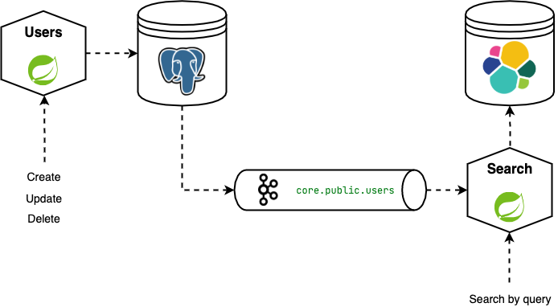

# Realtime Search



Users service perform CRUD operations by users. Changes in users database are captured via Debezium connector into Kafka topic.
Indexer service consume these events and update index in Elasticsearch. Search service send queries to Elasticsearch,
receive user id and then get full information by this id from Users service.

## Setup
```sh
git clone https://github.com/ivpal/realtime-search.git
cd realtime-search/
```
For build Docker images you need Java 14 or higher:
```sh
./gradlew dockerBuildImage
```

## Run
```sh
docker-compose -f docker/docker-compose.yml up -d
```

### Start PostgreSQL connector
```sh
curl --location --request POST 'localhost:8083/connectors/' \
--header 'Content-Type: application/json' \
--data-raw '{
  "name": "users-connector",
  "config": {
    "connector.class": "io.debezium.connector.postgresql.PostgresConnector",
    "tasks.max": "1",
    "database.hostname": "postgres",
    "database.port": "5432",
    "database.user": "postgres",
    "database.password": "postgres",
    "database.dbname" : "postgres",
    "database.server.id": "184054",
    "database.server.name": "core",
    "table.whitelist": "public.users",
    "database.history.kafka.bootstrap.servers": "kafka:9092",
    "database.history.kafka.topic": "schema-changes.users"
  }
}'
```

## Usage
### Create user
```sh
curl --location --request POST 'localhost:8080/api' \
--header 'Content-Type: application/json' \
--data-raw '{
    "first_name": "Pavel",
    "last_name": "Ivanov"
}'
```

Then search request:

```sh
curl --location --request GET 'localhost:8081/search?q=Pavel'
```
Should return:
```json
[
  {
    "id": 1,
    "first_name": "Pavel",
    "last_name": "Ivanov"
  }
]
```
### Update user
```sh
curl --location --request PUT 'localhost:8080/api/1' \
--header 'Content-Type: application/json' \
--data-raw '{
    "first_name": "Pavel",
    "last_name": "Smirnov"
}'
```

Then search request:
```sh
curl --location --request GET 'localhost:8081/search?q=Pavel'
```
Should return:
```json
[
  {
    "id": 1,
    "first_name": "Pavel",
    "last_name": "Smirnov"
  }
]
```

### Delete user
```sh
curl --location --request DELETE 'localhost:8080/api/1'
```

Then search request:
```sh
curl --location --request GET 'localhost:8081/search?q=Pavel'
```
Should return:
```json
[]
```
